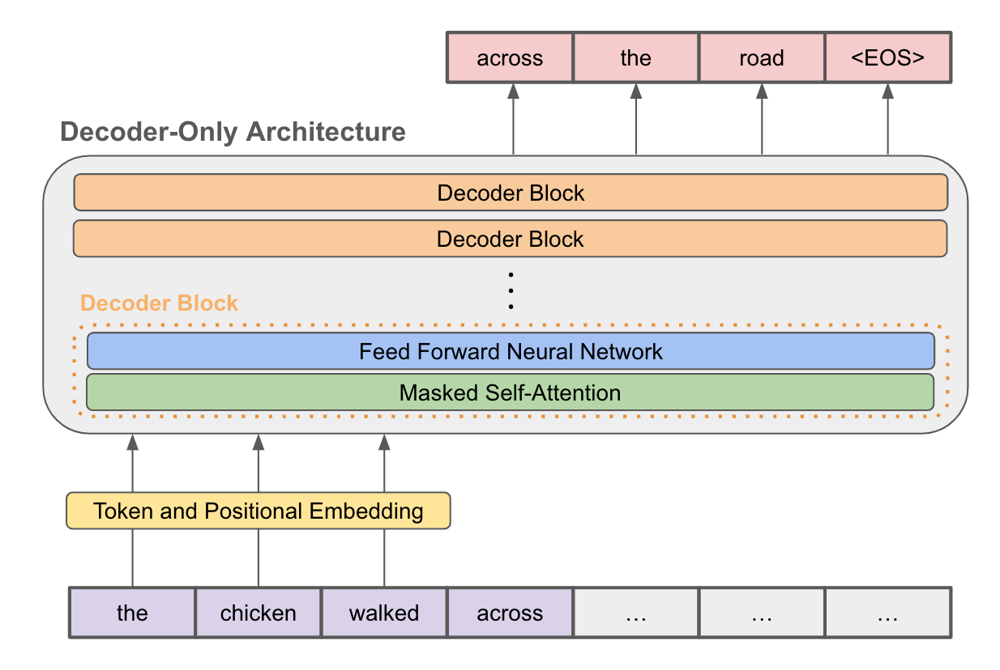

# GPT-2 Chatbot

## Overview

The GPT-2 Chatbot is a conversational AI powered by the GPT-2 language model, fine-tuned to engage in human-like conversations. It can be used for various natural language understanding and generation tasks, including chatbots, content generation, and more.

## Demo

You can experience my GPT-2 Chatbot in action by cloning the repository and running main.py.

## Features

- Natural language understanding and generation.
- Pre-trained GPT-2 model for realistic conversations.
- Easy integration into chatbot applications.
